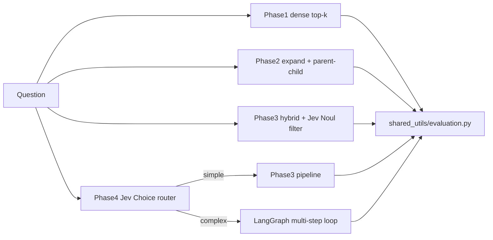

# Beat the Leaderboard: Enterprise RAG (refined plan)

Repo root: the current workspace `/Users/akash/Studies/enterprise-rag` (no rename). We run one step at a time and stop after each one so you can review it.

## What changed from your draft

- **Documents come from local ./all_documents.** This is the unzipped `all_documents.zip` from the [Onyx GitHub release](https://github.com/onyx-dot-app/EnterpriseRAG-Bench/releases/latest). Its layout is `all_documents/<source_type>/<nested dirs>/dsid_<uuid>_<sha>_<name>.txt`. The first line of each file is the title and the rest is the content ([quickstart.md](https://github.com/onyx-dot-app/EnterpriseRAG-Bench/blob/main/quickstart.md)). Questions still come from Hugging Face (`questions` config, `test` split). I've already checked that config: 500 questions, 722 unique gold IDs.
- **Jev uses the real TypeSafe SDK.** The package is `typesafe-sdk`, with `AsyncTypeSafeClient`, `Noul` and `Choice` ([Python SDK docs](https://docs.typesafe.ai/sdk/python.md)). The reranker follows the ["Classifying RAG passages" cookbook](https://docs.typesafe.ai/cookbooks/classifying_rag_passages.md). The router follows the [intent routing pattern](https://docs.typesafe.ai/patterns/intent-routing.md) and routes only when confidence is high enough. `langchain-typesafe` (`TypeSafeClassifier`, described in the [LangChain Jev post](https://www.langchain.com/blog/building-a-harness-with-jev)) is optional and only used if it makes the LangGraph nodes cleaner.
- **Qdrant from Phase 1 onward.** Every phase uses Qdrant, which keeps comparisons fair. Phase 1 uses dense cosine search only, and Phase 3 adds a BM25 sparse vector through `fastembed` (`Qdrant/bm25`). Each phase writes to its own collection (`p1_naive`, `p2_parent_child`, `p3_hybrid`).

## Rules for all code

These apply to every file in every step.

### Use paid APIs as cheaply as possible

- **Never pay twice for the same thing.** Embeddings, query expansions, Jev answers, generated answers and judge verdicts are saved in a SQLite cache on disk (`shared_utils/cache.py`). The cache key is a hash of the model, the input and the prompt version, so re-running a step or an evaluation costs nothing unless something actually changed.
- **Ingest only what's missing.** Qdrant point IDs are fixed per chunk (a UUIDv5 of the document's `path` and chunk index; `path`, not `doc_id`, because 4 doc_ids are shared by two different files in the corpus). Before embedding, ingestion checks which IDs already exist and skips them.
- **Batch every call.** Embeddings go out in large batches (for example 256 texts per request). All Jev questions about one state go in a single request, since extra questions barely add latency or cost.
- **Use the cheapest model that does the job.** Jev (a classifier) handles yes/no and routing decisions instead of an LLM. A small model handles query expansion and answering, and only the judge uses a stronger model. All model names live in `config.py`.
- **Keep prompts small.** Only deduplicated evidence that passed the reranker reaches the generator. Context is capped by a token budget (`tiktoken`), outputs are capped with `max_tokens`, and structured outputs are used wherever the model returns data rather than prose.
- **Do free work first.** BM25 and dense retrieval narrow the candidates before any paid rerank call. Jev scores only the top-N candidates (N is set in config). The Phase 4 agent loop stops after 3 iterations and stops early once the sufficiency check passes.
- **Try it small before running it big.** Every command-line tool has `--limit` and `--dry-run` flags. A dry run estimates token counts and cost before spending anything. After each run, the evaluation logs actual token usage and cost per phase to `results/`, so each phase's score has a cost next to it.
- **Rate limits and retries:** calls run concurrently, capped by a semaphore, with exponential-backoff retries (the SDK's `RetryPolicy` for Jev). A failed batch is retried by itself instead of restarting the whole run.

### Document the code thoroughly

This is a teaching repo, so the code is written to be read.

- **Every module** opens with a docstring covering its purpose, where it fits in the series, how to run it, and what it reads and writes.
- **Every function and class** has a docstring with arguments, return value, side effects, and any API cost it incurs.
- **Inline comments** explain the reasoning: why a threshold or chunk size was chosen, what trade-off it makes, how it saves money, and which benchmark weakness it targets (for example "helps the Conflicting Info questions").
- **Each phase folder** has a short `README.md` covering what it changes from the previous phase, how to run it, and a table of its scores and cost.

## Target layout

```text
enterprise-rag/
├── docker-compose.yml          # qdrant/qdrant, ports 6333/6334, volume ./qdrant_storage
├── requirements.txt            # replaces current minimal one
├── .env.example                # OPENAI_API_KEY, TYPESAFE_API_KEY, QDRANT_URL, model names
├── .gitignore                  # data/, qdrant_storage/, .env, results/
├── README.md                   # series overview + per-phase score table
├── data/
│   ├── local_onyx_source/all_documents/   # user-provided, gitignored
│   └── raw_onyx_subset/                   # mini_redwood_docs.jsonl, mini_redwood_qa.jsonl
├── scripts/curate_mini_redwood.py
├── shared_utils/
│   ├── config.py               # pydantic-settings: paths, models, top_k, thresholds
│   ├── cache.py                # SQLite cache for embeddings, LLM, Jev and judge calls
│   ├── llm.py                  # cached, token-budgeted, usage-tracked model wrappers
│   ├── loaders.py              # Step 3
│   └── evaluation.py
├── phase_1_baseline/ ingest_naive.py, query_naive.py
├── phase_2_data_mastery/ ingest_parent_child.py, query_expansion.py, query_p2.py
├── phase_3_jev_reranker/ ingest_hybrid.py, jev_reranker.py, query_p3.py
├── phase_4_agent_router/ graph.py, nodes.py, router.py
├── results/                    # per-phase answers + metrics JSON, gitignored
└── run_eval.py
```

Every phase exposes the same interface, `answer(question) -> {"answer": str, "doc_ids": list[str]}`. That lets one evaluator score all phases in the same way.




## Step 1: Foundation and data curation

- Scaffold the layout above, plus `docker-compose.yml`, `.env.example`, `.gitignore` and `shared_utils/config.py`.
- Build the cost layer first so every later step uses it:
  - `shared_utils/cache.py`: the SQLite cache for paid calls.
  - `shared_utils/llm.py`: cached chat, embedding and Jev wrappers that count tokens and cost per run and enforce the `max_tokens` and context budgets.
- Rewrite [scripts/curate_mini_redwood.py](scripts/curate_mini_redwood.py) to read the local corpus instead of Hugging Face documents:
  - **Build an index without reading files.** Walk `all_documents/` with `os.scandir`, take `source_type` from the top-level folder, and parse `doc_id` from the filename with a `dsid_[0-9a-f]{32}` pattern (hyphens are removed, so IDs match Hugging Face). This gives a pandas index of `doc_id, source_type, path`, about 511k rows.
  - **Gold documents:** every row whose ID is in the gold ID set. Missing gold IDs are logged as a warning.
  - **Noise documents:** reuse the existing `allocate_quotas` / `sample_noise_indices` logic. That's 4,000 documents from slack, gmail, linear and confluence (1,000 each by default, with `--allocation proportional` available), never picking gold documents.
  - **Read only the ~4.7k selected files.** Split each into `title` (first line) and `content`. Output columns are `doc_id, source_type, title, content, path, is_gold`. Shuffle, then write both JSONL files, reusing the existing `write_jsonl`.
  - Add a `--source-dir` flag (default `data/local_onyx_source/all_documents`). The script fails clearly if the folder is missing or empty.
  - On the first run I'll print one sample file to confirm the filename and title assumptions before relying on them.
- `shared_utils/evaluation.py`:
  - **Document Recall:** `|retrieved ∩ expected| / |expected|`. Questions with no expected docs are excluded.
  - **Invalid Extra Docs:** `|retrieved − expected|`, averaged over questions.
  - **Correctness** (0 or 1) and **Completeness** (share of `answer_facts` the answer covers), both judged by an LLM against `gold_answer` / `answer_facts`.
  - **Overall Score:** `mean(correct * completeness)`, the leaderboard formula. "Info Not Found" questions count as correct when the system declines to answer.
  - Results are broken down by `question_type`. The script runs from the command line as `python -m shared_utils.evaluation results/p1.jsonl`, and a `--no-llm` flag computes the retrieval-only metrics without any LLM cost.

## Step 2: Phase 1, the naive baseline

- `ingest_naive.py`: `RecursiveCharacterTextSplitter(chunk_size=1000, overlap=200)`, then embed and upsert into Qdrant (`p1_naive`, cosine distance).
- `query_naive.py`: top-k=10 similarity search, the retrieved chunks' doc IDs are deduplicated, then one LLM call writes the answer.
- Evaluate and log the scores in the README. Expected result: low recall on the conflicting-info, completeness and project questions, plus many invalid extra docs.

## Step 3: Phase 2, data mastery

- `shared_utils/loaders.py`: source-specific parsers. Slack messages are grouped into thread blocks with speaker and timestamp headers, and Gmail threads get their quoted replies removed and are ordered as a clean conversation. Confluence and Linear keep headings and fields as metadata. Each document gets metadata: `doc_id, source_type, title, channel/thread` where available.
- Parent-child chunks: small child chunks (~300 tokens) are embedded, and each points to its parent section (~1,500 tokens or the whole doc). Retrieval matches children and returns their parents, deduplicated by `doc_id`.
- `query_expansion.py`: one LLM call returns 3–5 rewrites plus expanded acronyms and codenames. The results are fused with Reciprocal Rank Fusion (RRF).
- Re-run the evaluation and compare with Phase 1.

## Step 4: Phase 3, hybrid search and the Jev reranker

- `ingest_hybrid.py`: a Qdrant collection with named dense and `bm25` sparse vectors. Search uses the Query API prefetch with RRF fusion.
- `jev_reranker.py`: with `AsyncTypeSafeClient`, send one request per (query, candidate) pair, all run concurrently with `asyncio.gather` and a semaphore. Each request asks several Nouls at once, which runs them in parallel:
  - `is_relevant`
  - `contains_answer_evidence`
  - `contradicts_or_updates_other_info` (for the conflicting-info questions)
- The routing rules live in code, not in a prompt:
  - A candidate is **included** when relevance and evidence clear their thresholds.
  - Candidates that score high on the conflict question go to a **conflicting_evidence** block for the generator.
  - Everything else is **excluded**, which is what cuts Invalid Extra Docs.
- Thresholds live in `config.py`, and I'll add a small tuning script that sweeps them against recall and invalid-extra-docs.

## Step 5: Phase 4, the LangGraph router and submission prep

- `router.py`: one Jev request asks several questions about the question text:
  - a `Choice` intent: `simple_lookup`, `multi_doc_aggregate`, `conflicting_info`, `exhaustive_list`, `broad_summary`
  - a `Noul`: `needs_multiple_sources`
  If the intent's confidence is below a threshold, the question goes to the complex path.
- `graph.py` (LangGraph `StateGraph`):
  - **Simple path:** `route` → `fast_path` (the Phase 3 pipeline) → `generate`.
  - **Complex path:** `route` → `plan_subqueries` → `retrieve_rerank` → `sufficiency_check` → `generate`. The sufficiency check is a Jev Noul, "evidence is sufficient to answer completely". If it fails, the graph loops back to `plan_subqueries`, with a maximum of 3 iterations.
  - **Declining to answer:** if there's no included evidence, the model says it doesn't know, which targets the "Info Not Found" questions.
- `run_eval.py`: a command-line entry point with `--corpus {mini,full}`, `--ingest`, `--limit` and `--output`. The Onyx team can point it at the full 511k `all_documents` corpus. Before building it, I'll check the answer-file format that Onyx's own evaluation harness expects so the output drops straight into it.

## Defaults (change any before we start)

- **Answer model and judge:** OpenAI through `langchain.chat_models.init_chat_model`, configured in `.env` (for example `gpt-5.6-luna` to answer and a stronger model to judge). Any LangChain provider works.
- **Embeddings:** `text-embedding-3-small`, which is fast and cheap. You can switch to `BAAI/bge-m3` in config, which runs locally and is slower on a Mac CPU.
- **Python:** 3.11+ in a project venv. `requirements.txt` lists `datasets, pandas, pydantic-settings, python-dotenv, langchain, langchain-openai, langchain-qdrant, langchain-text-splitters, langgraph, qdrant-client, fastembed, typesafe-sdk, tqdm`.


- API keys in `.env`: `OPENAI_API_KEY` from Step 1 onward (for the evaluation judge), and `TYPESAFE_API_KEY` from Step 4.

